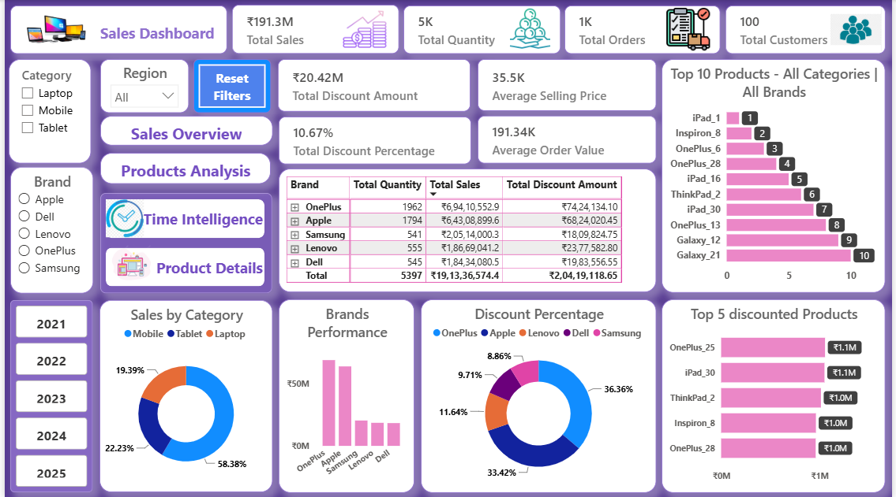

# 📊 IT Sales Performance Dashboard

An interactive Power BI dashboard designed to analyze IT sales
performance across products, brands, categories, regions and cities.

The dashboard combines executive-level KPIs, time-intelligence
analysis and product-level insights to support data-driven
business analysis.

---

## 📸 Dashboard Preview

### Sales Dashboard



### Time Intelligence


### Product Details


---

## 🎯 Business Objective

The objective of this project is to develop an interactive sales
analytics dashboard that enables users to:

- Monitor overall sales performance
- Analyze sales across product categories and brands
- Compare regional and city-level performance
- Track monthly, quarterly and yearly sales trends
- Compare sales with previous-year performance
- Analyze product-level sales and order details
- Identify products and brands contributing to sales performance

---

## 📌 Key Performance Indicators

The dashboard provides the following key metrics:

- Total Sales
- Total Quantity
- Total Orders
- Total Customers
- Average Selling Price
- Average Order Value
- Total Discount Amount
- Discount Percentage

---

## 📊 Dashboard Pages

### 1. Sales Dashboard

The main dashboard provides an executive overview of sales
performance through interactive KPIs, category analysis,
brand performance, discount analysis and top-product analysis.

### 2. Time Intelligence

The Time Intelligence page provides time-based sales analysis
including:

- MTD Sales
- QTD Sales
- YTD Sales
- Same Period Last Year
- Monthly sales trends
- City-wise performance

### 3. Product Details

The Product Details page provides granular analysis including:

- Regional sales
- Monthly sales
- City-wise sales
- Order-level details
- Product-specific KPIs

---

## 🛠️ Tools & Technologies

- Power BI
- Power Query
- DAX
- Data Modeling
- Data Visualization
- Time Intelligence

---

## 📈 Power BI Features Demonstrated

- Interactive slicers
- KPI cards
- Bar charts
- Donut charts
- Line and area charts
- Tables
- Map visualization
- Page navigation
- Reset Filters functionality
- Product-level filtering
- Time-intelligence analysis
- Interactive dashboard design

---

## 💡 Key Analysis Areas

The dashboard enables analysis of:

- Sales performance by category
- Brand-wise sales performance
- Regional sales performance
- City-wise sales performance
- Monthly, quarterly and yearly trends
- Product-level performance
- Discount patterns
- Previous-year sales comparison

---

## 💡 Key Insights

Based on the current dashboard view, the analysis highlights the following patterns:

- 📱 **Mobile products contribute the largest share of category sales**, accounting for approximately 58.38% of sales, followed by Tablets at 22.23% and Laptops at 19.39%.

- 🏷️ **OnePlus records the highest sales among the displayed brands**, with approximately ₹69.4M in total sales, followed by Apple at approximately ₹63.4M.

- 🌍 **Sales performance varies across regions and cities**, with the dashboard providing interactive comparisons to identify higher- and lower-performing locations.

- 📅 **Sales fluctuate across months**, with September showing the highest MTD sales in the displayed time-intelligence view at approximately ₹6.0M.

- 📈 **Yearly sales performance varies over time**, with approximately ₹42M in YTD sales for 2021 and 2023, ₹32M in 2022, ₹36M in 2024 and ₹40M in 2025.

- 💰 **Discounts represent a measurable component of sales activity**, with the dashboard showing approximately ₹20.42M in total discount amount and a 10.67% discount percentage.

- 🛍️ **Product-level analysis enables deeper investigation of individual products**, including regional sales, monthly trends, city performance and order-level details.

- 🔄 **Same-period year-over-year comparison** allows users to compare current sales against the corresponding previous-year period.

---

## 📂 Repository Structure

```text
IT-sales-performance-dashboard/
│
├── Power_BI/
│   └── IT_Sales_Performance_Dashboard.pbix
│
├── Screenshots/
│   ├── Sales Dashboard.png
│   ├── Time Intelligence.png
│   └── Product Details.png
│
└── README.md
```
---

## 🚀 How to Use

1. Download or clone this repository.
2. Open `IT_Sales_Performance_Dashboard.pbix` using Power BI Desktop.
3. Refresh the data if required.
4. Use the available filters, slicers and navigation buttons to explore the dashboard.
5. Navigate between the Sales Dashboard, Time Intelligence and Product Details pages.

---

## 👤 Author

**Vivek Kushwah**

Data Analyst | Python | SQL | Power BI | Tableau | Machine Learning

🔗 [Connect with me on LinkedIn](https://www.linkedin.com/in/vivek--kushwah/)
